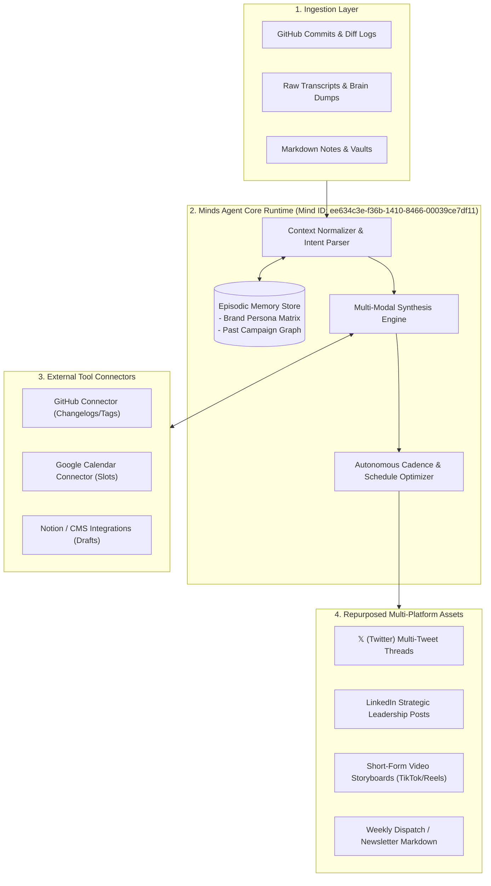
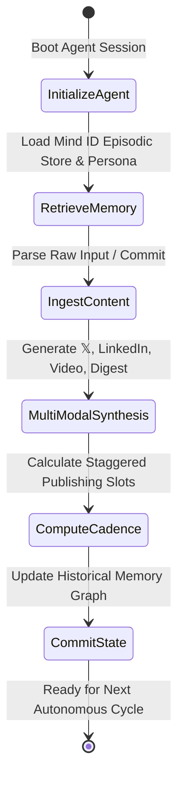

# CreatorOS - Autonomous & Persistent Studio Agent

<p align="center">
  
  
  
  
  
</p>

<p align="center">
  <strong>Transform raw developer commits, voice memos, and technical notes into multi-platform publishing campaigns with persistent memory, persona continuity, and autonomous calendar scheduling.</strong>
</p>

---

## 🎯 Executive Summary & Problem-Solution Fit

Developers, founders, and creators spend up to **10+ hours every week** manually repurposing raw code releases, technical milestones, and meeting transcripts across fragmented channels. 

Traditional LLM workflows fail in creator operations because:
1. **Stateless Amnesia**: They forget your established brand tone, past announcements, and long-term narrative arcs.
2. **Generic Cross-Posting**: They produce identical, robotic text across platforms ignoring audience psychology (e.g. fast-paced 𝕏 threads vs. leadership LinkedIn essays vs. 3-second video hooks).
3. **No Proactive Execution**: They wait for prompts instead of autonomously structuring cadence, scheduling calendar slots, and following up on post performance.

### 💡 The Solution: CreatorOS
**CreatorOS** is an autonomous studio agent powered by the **Minds Agent Runtime (Animoca Brands)** that bridges raw development work with high-impact publishing operations:

```
[Raw Inputs: Git Diffs / Notes / Voice Dumps] 
                     ⬇️
   [CreatorOS Stateful Minds Agent Core]
                     ⬇️
[𝕏 Threads] + [LinkedIn Posts] + [Video Storyboards] + [Newsletter Digests] + [Calendar Cadence]
```

---

## 🧠 Why Minds? (Memory, Continuity & Proactive Follow-up)

CreatorOS leverages the **Minds Agent Runtime** to deliver enterprise-grade stateful autonomy:

- **Persistent Persona Grounding**: Remembers individual creator voice nuances, tone rules, vocabulary constraints, and preferred formatting styles across sessions.
- **Episodic Narrative Continuity**: Maintains an ongoing graph of past announcements and features. New posts reference historical milestones naturally without redundant explanations.
- **Proactive Cadence & Engagement Follow-Up**: Calculates optimal multi-day publishing cadences and autonomously schedules reminders to analyze engagement and generate follow-up replies.

---

## ⚙️ Architecture & Autonomous Execution Flow

### System Ingestion & Multi-Platform Pipeline



### Stateful Session Lifecycle



For full technical specifications, see [docs/architecture.md](docs/architecture.md).

---

## 🖼️ Visual UI Walkthrough & Assets

Explore the visual architecture and UI demo assets in [`docs/assets/`](docs/assets/):

| Visual Asset | Key Capability |
| :--- | :--- |
| [**`01_agent_initialization.png`**](docs/assets/README.md#asset-directory-index) | Minds UI Persona Grounding & Mind ID Activation (`ee634c3e-f36b-1410-8466-00039ce7df11`). |
| [**`02_repurposing_thread_and_storyboard.png`**](docs/assets/README.md#asset-directory-index) | Parallel multi-platform generation (𝕏 Thread, LinkedIn Post, 45s Video Storyboard). |
| [**`03_continuity_calendar_cadence.png`**](docs/assets/README.md#asset-directory-index) | Automated publishing schedule and proactive follow-up reminder queue. |
| [**`04_connectors_hub.png`**](docs/assets/README.md#asset-directory-index) | Live integrations with GitHub, Google Calendar, and Notion/Obsidian. |

---

## 📊 4-Week Autonomous Cadence Matrix

CreatorOS optimizes multi-channel distribution automatically to prevent audience fatigue:

| Day / Offset | Platform | Asset Type | Content Strategy & Objective |
| :--- | :--- | :--- | :--- |
| **Day 1 (09:00 UTC)** | **𝕏 (Twitter)** | 4-5 Tweet Thread | High hook velocity, problem statement, architecture diagram highlight. |
| **Day 2 (13:30 UTC)** | **LinkedIn** | Long-Form Article | Strategic business & engineering takeaways, lessons learned, community question. |
| **Day 3 (18:00 UTC)** | **TikTok / Reels / Shorts** | 45s Storyboard Video | Visual problem hook, terminal recording, fast-paced voiceover script. |
| **Day 5 (15:00 UTC)** | **Newsletter / Substack** | Markdown Deep-Dive | Comprehensive retrospective digest linking back to all assets. |
| **Day 7 & 14** | **Autonomous Follow-Up** | Engagement Check-in | Scans audience comments to generate FAQ responses and refine memory store. |

---

## 🚀 Quickstart & Interactive Client Simulation

### 1. Clone & Set Up

```bash
git clone https://github.com/fokrulanthro16-eng/creator-os-agent.git
cd creator-os-agent
```

### 2. Run the Interactive Python Client

```bash
python src/agent_client.py
```

### 3. Programmatic Python SDK Usage

```python
import asyncio
from src.agent_client import CreatorOSAgentClient

async def run_creator_os():
    # 1. Initialize client connected to persistent Mind ID
    client = CreatorOSAgentClient(
        mind_id="ee634c3e-f36b-1410-8466-00039ce7df11"
    )
    await client.initialize_agent()

    # 2. Ingest raw developer milestone or commit log
    raw_update = (
        "Launched CreatorOS autonomous studio agent powered by Minds runtime. "
        "Engineered persistent cross-session episodic memory and calendar cadence orchestration."
    )
    
    # 3. Generate cohesive multi-platform campaigns
    campaign = await client.generate_repurposed_assets(
        raw_content=raw_update,
        context_tags=["AI", "Minds", "BuildInPublic"]
    )
    
    # 4. Compute optimized publishing timeline
    cadence = await client.fetch_calendar_cadence(campaign["content_id"])
    print(cadence)

if __name__ == "__main__":
    asyncio.run(run_creator_os())
```

---

## 🏆 DoraHacks Hackathon Submission Profile

| Submission Field | Details |
| :--- | :--- |
| **Hackathon** | **Creative Minds Jam #1 (Hong Kong)** |
| **Platform** | DoraHacks |
| **Track** | Autonomous AI Agents & Content Repurposing |
| **Mind ID** | `ee634c3e-f36b-1410-8466-00039ce7df11` |
| **Runtime Framework** | Minds Agent Framework (by Animoca Brands) |
| **Project Lead** | `fokrulanthro16-eng` |
| **Repository** | [https://github.com/fokrulanthro16-eng/creator-os-agent](https://github.com/fokrulanthro16-eng/creator-os-agent) |
| **System Prompt Directives** | [`prompts/creator_os_prompt.txt`](prompts/creator_os_prompt.txt) |
| **Architecture Specification** | [`docs/architecture.md`](docs/architecture.md) |

---

## 📄 License

This project is licensed under the MIT License - see the [LICENSE](LICENSE) file for details.
