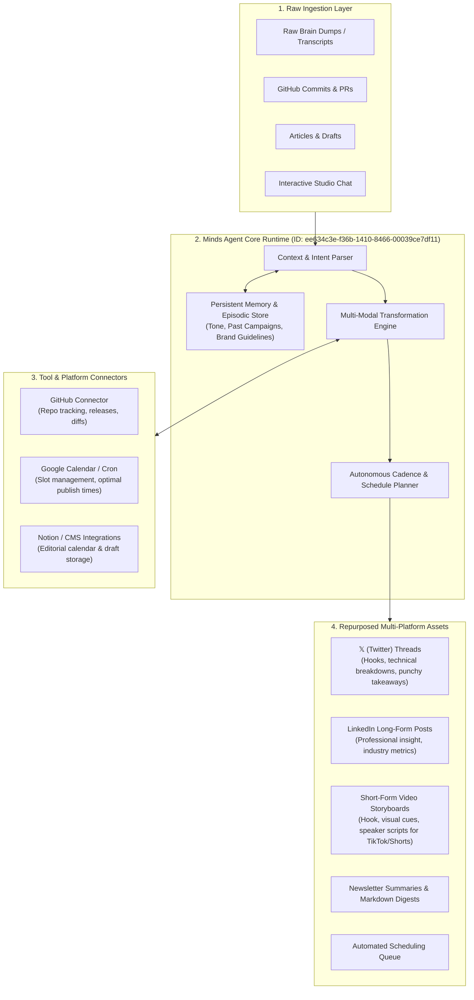

# CreatorOS Architecture & System Design

CreatorOS is an autonomous, persistent studio agent powered by the **Minds Agent Runtime (by Animoca Brands)**. It transforms raw developer or creator logs, GitHub commits, transcripts, and drafts into cohesive multi-platform publishing campaigns while maintaining long-term memory across sessions.

---

## 1. High-Level Architecture Diagram

### Mermaid Diagram



### ASCII Architecture

```
+-----------------------------------------------------------------------------------+
|                            RAW INGESTION LAYER                                    |
|   [Notes / Transcripts]   [GitHub Commits / Diffs]   [Interactive User Prompts]   |
+------------------------------------------+----------------------------------------+
                                           |
                                           v
+-----------------------------------------------------------------------------------+
|                        MINDS AGENT CORE RUNTIME                                   |
|   +---------------------------------------------------------------------------+   |
|   | Persistent Memory & Context Engine (Episodic Store & Persona Profiles)    |   |
|   +---------------------------------------------------------------------------+   |
|   | Multi-Modal Style & Tone Normalizer                                       |   |
|   +---------------------------------------------------------------------------+   |
|   | Autonomous Follow-Up & Content Cadence Planner                            |   |
|   +---------------------------------------------------------------------------+   |
+---------------------+---------------------------------------+---------------------+
                      |                                       |
                      v                                       v
+---------------------------------------+   +---------------------------------------+
|          EXTERNAL CONNECTORS          |   |      REPURPOSED ASSET GENERATION      |
|  - GitHub API (Changelogs & Repos)    |   |  - 𝕏 / Twitter Multi-Tweet Threads    |
|  - Google Calendar (Publishing Slots) |   |  - LinkedIn Insightful Articles       |
|  - Notion / Obsidian (Knowledge Base) |   |  - Short-form Video Storyboards       |
+---------------------------------------+   |  - Release Digest & Newsletters       |
                                            +---------------------------------------+
```

---

## 2. Core Pillars & Mechanism

### A. Persistent Memory & Profile Continuity
Unlike stateless LLM workflows, CreatorOS utilizes the **Minds Agent Runtime** to maintain stateful vector-and-graph episodic memory:
- **Creator Persona Profile**: Stores vocabulary preferences, tone nuances (e.g., energetic vs. deeply technical), target audience demographics, and prohibited buzzwords.
- **Cross-Session Campaign Memory**: Remembers past threads, release announcements, and narrative arcs. If a feature was introduced 2 weeks ago, subsequent posts refer back to it naturally rather than re-introducing it from scratch.
- **Performance Feedback Loop**: Ingests user reactions and engagement stats to adjust content structure over time.

### B. Session Continuity & Contextual Stitching
- Sessions are keyed by creator identity and project workspaces.
- Seamless context resumption: Starting a new session automatically pulls recent activities, pending publishing queues, and uncompleted drafts.
- Deduplication prevents repetitive hooks and ensures multi-platform content feels tailored rather than blindly copy-pasted.

### C. Multi-Platform Transformation Pipeline
1. **Source Normalization**: Strips markdown, parses code snippets, extracts key milestones or emotional punchlines.
2. **Platform Specialization**:
   - **X (Twitter)**: Focuses on high-retention hook design, structured bullet points, and actionable summaries.
   - **LinkedIn**: Converts technical milestones into strategic leadership takeaways with appropriate white space and hashtags.
   - **Short-form Video (Reels / TikTok / Shorts)**: Produces a 3-part storyboard with scene descriptions, on-screen text overlays, and spoken script pacing.
   - **Newsletter / Blog**: Synthesizes a coherent long-form narrative.

### D. Autonomous Scheduling & Cadence Optimization
- Analyzes creator schedule and publishing windows.
- Suggests optimal distribution times across timezones.
- Dispatches reminders or triggers webhooks for scheduled publication.
