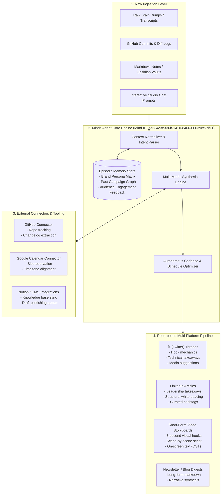
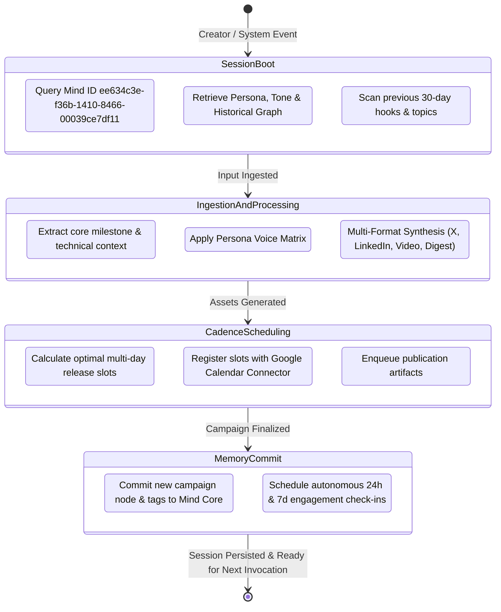

# CreatorOS Technical Architecture & System Specification

CreatorOS is an autonomous, persistent studio agent built on the **Minds Agent Runtime (by Animoca Brands)** for the **Creative Minds Jam #1 (Hong Kong)** hackathon. It empowers developers and creators by transforming unstructured inputs into tailored, multi-platform publishing campaigns with continuous cross-session memory and autonomous cadence scheduling.

---

## 1. End-to-End System Architecture

---

## 2. Persistence State Lifecycle & Session Continuity

Unlike traditional stateless LLM workflows where every chat prompt resets context, CreatorOS maintains a 4-stage lifecycle across interactions:

---

## 3. Persistent Memory & Tone Matrix

### Episodic Memory Graph Structure
The memory engine organizes contextual vectors into three interconnected tiers:
1. **Creator Persona Matrix**: Tone (pragmatic, technical, enthusiastic), vocabulary blacklists, preferred hashtag style, target reader personas (Developers, Founders, Web3 Creators).
2. **Campaign Lineage Graph**: Links each new asset to historical milestones. When releasing version `2.4`, CreatorOS references the architecture changes from version `2.0` automatically.
3. **Engagement Feedback Loop**: Stores high-performing hook patterns and adapts future threads based on audience responses.

---

## 4. Hackathon Track Alignment: Creative Minds Jam #1 (Hong Kong)

| Evaluation Pillar | Hackathon Requirement | CreatorOS Implementation |
| :--- | :--- | :--- |
| **Agentic Autonomy** | Self-directed execution beyond passive chat | Autonomously calculates 4-stage publication schedules and queues reminders for post-launch analytics. |
| **Stateful Continuity** | Long-term memory & persistent identity | Powered by Minds Agent runtime (Mind ID `ee634c3e-f36b-1410-8466-00039ce7df11`) with cross-session vector & episodic memory. |
| **Content Multi-Modality** | True multi-platform adaptation | Generates native 𝕏 threads, formatted LinkedIn leadership posts, 45-second video storyboards with on-screen text, and newsletter digests. |
| **Ecosystem Connectivity** | Interoperability with creator tools | Direct integration interfaces for GitHub, Google Calendar, and Notion. |

---

## 5. Security & Privacy Guardrails
- **Credential Isolation**: Minds API keys and external OAuth tokens are decoupled from the core generation prompts.
- **Zero Hallucination Policy**: Grounded strictly in source materials—technical diffs and user input.
- **Data Minimization**: Memory graphs retain compressed episodic summaries rather than raw sensitive transcripts.
